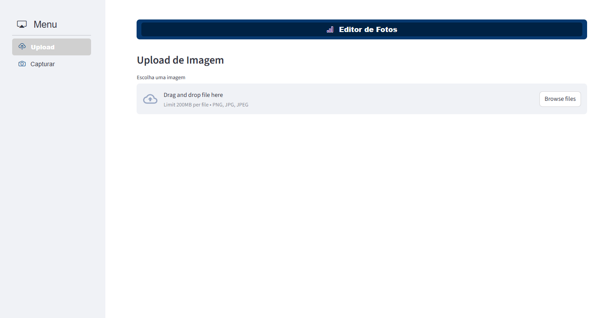
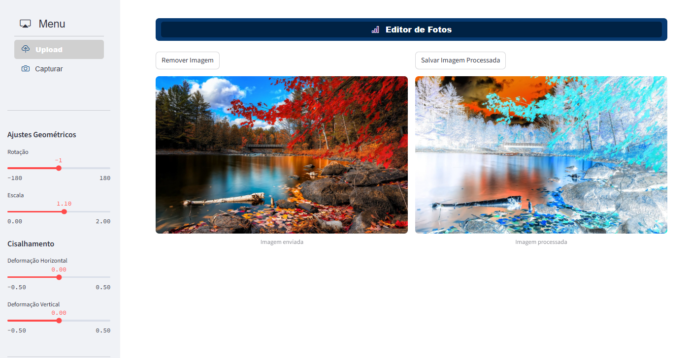
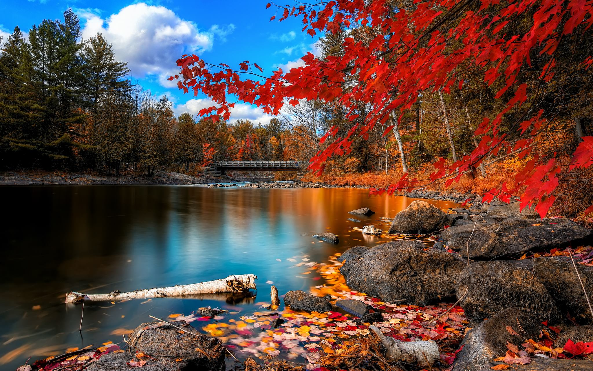
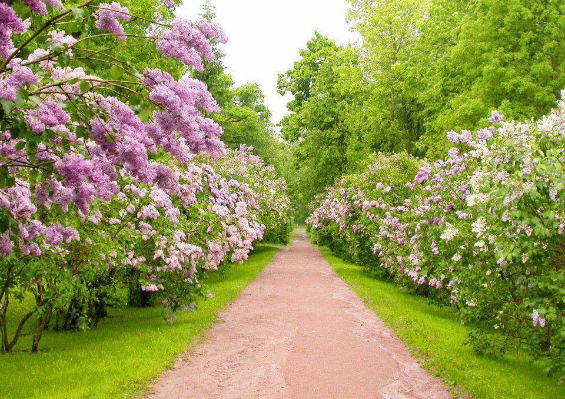
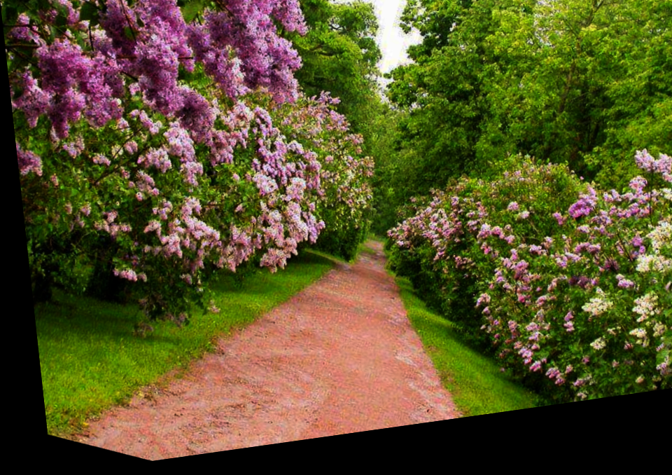

# 📸 Editor de Fotos com Python

Este projeto é um editor de fotos simples desenvolvido em Python, utilizando bibliotecas como OpenCV e Streamlit. Ele permite aplicar transformações como brilho, contraste, rotação, escala, cisalhamento, filtro negativo, transformação logarítmica, entre outras.

---

## 🖥️ Como rodar o projeto localmente

### 1. Clone o repositório
```bash
git clone https://github.com/robertojunior1202/Editor_Fotos_Python.git
cd Editor_Fotos_Python
```

### 2. Crie um ambiente virtual e o ative
```bash
#Criando o ambiente
python -m venv venv

#Ativando o ambiente em Windows
venv\Scripts\activate

#Ativando o ambiente em Linux/macOS
source venv/bin/activate
```

### 3. Instale as dependências
```bash
pip install -r requirements.txt
```

### 4. Execute a aplicação
```bash
streamlit run app.py
```

### 5. Acesso a aplicação
O acesso a aplicação pode ser feito localmente pelo link abaixo
http://localhost:8501

<br>


## ⚙️ Funcionalidades
📂 Upload de imagem e captura por webcam

🔆 Ajuste de brilho e contraste

↩️ Rotação e ajuste de escala

✂️ Cisalhamento (shear horizontal/vertical)

📈 Transformação logarítmica e potência

🧪 Efeito negativo (inversão dos pixels)

💾 Download da imagem editada

<br>

## 🧪 Exemplo de uso
- Faça upload de uma imagem
- Ajuste os sliders conforme desejar
- Veja a imagem sendo transformada em tempo real
- Faça o download da imagem final

<br>

Painel para Upload e Captura


<br>

Exemplo de Uso!


<br>

## 🛠️ Tecnologias utilizadas
- Python
- Streamlit
- OpenCV
- NumPy
- PIL (Pillow)

<br>

## 📷 Exemplos de Antes e Depois
Na pasta <b>output</b> podem ser encontrados alguns exemplos de imagens transformadas

Imagem Original 01


Imagem Transformada 01


<br>

Imagem Original 02


<br>

Imagem Transformada 02
